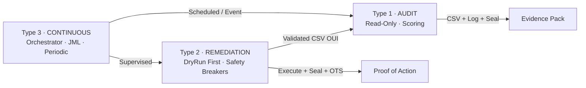

# IAM Control Framework 🔐

> **Industrial-Grade Identity & Access Management Automation**  
> *Framework professionnel pour l'audit, la remédiation et le contrôle continu IAM*

[](LICENSE)
[](https://github.com/PowerShell/PowerShell)
[](docs/compliance/)
[](docs/doctrine/sealing-protocol.md)
[](SCRIPT-METHODOLOGY.md)

---

## 🌐 Language / Langue

| 🇬🇧 [Quick Start](#-quick-start) · [Core Concepts](#-core-concepts) · [Compliance](#-compliance--réglementation) |
| 🇫🇷 [Démarrage Rapide](#-démarrage-rapide) · [Concepts Clés](#-concepts-clés-fr) · [Conformité](#-compliance--réglementation) |

---

## 🎯 Value Proposition / Proposition de Valeur

| 🇬🇧 English | 🇫🇷 Français |
|---|---|
| **For Security Teams**: Automate IAM audits with legally-admissible proofs. Every action is logged, sealed, and blockchain-anchored. | **Pour les équipes SecOps** : Automatisez vos audits IAM avec des preuves légalement opposables. Chaque action est tracée, scellée et ancrée blockchain. |
| **For Auditors**: Evidence packs mapped to ISO 27001, NIS2, NIST CSF 2.0, DORA, FINMA and CSSF — ready to present. | **Pour les auditeurs** : Dossiers de preuves cartographiés aux référentiels ISO 27001, NIS2, NIST CSF 2.0, DORA, FINMA et CSSF — prêts à l'emploi. |
| **For Consultants**: Client-agnostic framework. Instantiate via a single JSON config file — no code change needed. | **Pour les consultants** : Framework indépendant du client. Instanciation via un seul fichier JSON — aucune modification de code requise. |

---

## 🏗️ Core Concepts / Concepts Clés {#core-concepts}

### The 3 Script Types / Les 3 Types de Scripts



| Type | Purpose / Objectif | Key Safeguard / Protection clé | Output |
|---|---|---|---|
| **Type 1 · Audit** | Evaluate, score, map dérives · Évaluer, scorer, cartographier | Read-only absolute · Lecture seule absolue | `.csv` + `.log` + `.seal` + `.ots` |
| **Type 2 · Remediation** | Fix anomalies · Corriger les anomalies | DryRun mandatory + 4 Safety Breakers · DryRun obligatoire + 4 coupe-circuits | `.csv` + `.log` + `.seal` + `.ots` [+ `.tsr` CH/LU] |
| **Type 3 · Continuous** | Orchestrate periodic controls · Orchestrer les contrôles périodiques | Manager validation + auto-escalation · Validation manager + escalade auto | Access review reports + Sealed logs |

---

### 🛡️ Industrial-Grade Safeguards / Protections Industrielles

| Feature | Description | Why It Matters / Pourquoi c'est essentiel |
|---|---|---|
| **Safety Breakers (×4)** | CB1 horaire · CB2 masse absolue · CB3 masse relative · CB4 canary DryRun | Prevents accidental mass-impact · Évite tout incident de masse accidentel |
| **Notariat Numérique** | SHA-256 + OpenTimestamps (Bitcoin, gratuit) + RFC 3161 (CH/LU) | Legally admissible, tamper-proof logs · Logs infalsifiables et opposables |
| **3-List Strategy** | Whitelist · Greylist (délai de grâce) · Population | No edge-case left unhandled · Aucun cas intermédiaire ignoré |
| **Auth Abstraction** | `Auth-Helper.psm1` — Dev / Prod-Cert / Prod-Vault | Zero secrets in code · Zéro credential dans les scripts |
| **Schema Validation (§0)** | Config version check before any connection | Prevents silent config/script mismatches · Évite les comportements silencieux |
| **15-Section Methodology** | Every script follows the same anatomy | Readable by any consultant without its author · Lisible sans son auteur |

---

### 📊 The 3-List Strategy / La Stratégie des 3 Listes {#concepts-clés-fr}

```
┌─────────────────────────────────────────────────────────────┐
│  WHITELIST          │  GREYLIST              │  POPULATION   │
│  Protected          │  Under surveillance    │  Evaluated    │
│  Protégé            │  Sous surveillance     │  Évalué       │
│─────────────────────│────────────────────────│───────────────│
│  Service accounts   │  Inactive 60–89 days   │  All others   │
│  Break-glass        │  Orphan (active)       │  Tous les     │
│  API accounts       │  MFA exemption pending │  autres       │
│                     │  External grace period │               │
│  → Never remediated │  → Grace until expiry  │  → Scored &   │
│  → Own controls     │  → Owner notified J+1  │    remediated │
│    verified         │  → Auto-escalate at 0  │    per policy │
└─────────────────────────────────────────────────────────────┘
```

---

### 🔍 Scoring & Maturity / Score de Maturité IAM

| Score | Level / Niveau | Meaning / Signification | Recommended Action |
|---|---|---|---|
| 0–39 | **1 · Initial** | No formal IAM process · Pas de processus IAM formalisé | Urgent remediation plan |
| 40–59 | **2 · Developing** | Partial, non-systematic · Partiel, non systématique | Structured remediation |
| 60–74 | **3 · Defined** | Documented but unmeasured · Documenté mais non mesuré | Periodic controls |
| 75–89 | **4 · Managed** | Active, measured · Actif et mesuré | Continuous governance |
| 90–100 | **5 · Optimized** | Continuous improvement · Amélioration continue | ISO 27001 certification |

Scores aligned with ISO 27001:2022, NIST CSF 2.0 and CIS Controls v8.

---

## 🚀 Quick Start / Démarrage Rapide

### Prerequisites / Prérequis

- PowerShell 7.2+
- Microsoft.Graph module (`Install-Module Microsoft.Graph`)
- Git
- (Optional / Optionnel) Python + opentimestamps-client for OTS verification

### 1. Clone & Configure / Cloner et configurer

```bash
git clone https://github.com/CrepuSkull/iam-control-framework.git
cd iam-control-framework

# Copy and rename the params template for your client
# Copier et renommer le template de paramètres pour votre client
cp params/IAM-Params-TEMPLATE.json params/IAM-Params-ACME-FR.json
# Edit the JSON with your client-specific values
# Renseigner les valeurs spécifiques au client dans le JSON
```

### 2. Run an Audit / Lancer un audit

```powershell
# Type 1 — Audit MFA (read-only, safe on any environment)
# Type 1 — Audit MFA (lecture seule, sans danger sur tout environnement)
.\scripts\type1-audit\Audit-MFA.ps1 `
    -ParamsFile ".\params\IAM-Params-ACME-FR.json"

# Outputs generated in: outputs/ACME-FR/01_audit/
# Fichiers générés dans : outputs/ACME-FR/01_audit/
#   ACME-FR_AUDIT_MFA_20260601.csv
#   ACME-FR_AUDIT_MFA_20260601.log
#   ACME-FR_AUDIT_MFA_20260601.seal
#   ACME-FR_AUDIT_MFA_20260601.log.ots
```

### 3. Validate & Remediate / Valider et remédier

```powershell
# Step 1 — Open CSV and fill "OUI" in the Valider column for targeted rows
# Étape 1 — Ouvrir le CSV et saisir "OUI" dans la colonne Valider pour les lignes ciblées

# Step 2 — DryRun (default, always runs first)
# Étape 2 — DryRun (mode par défaut, toujours exécuté en premier)
.\scripts\type2-remediation\Remediate-MFA.ps1 `
    -ParamsFile ".\params\IAM-Params-ACME-FR.json"

# Step 3 — Review DryRun log, then execute for real
# Étape 3 — Relire le log DryRun, puis exécuter réellement
.\scripts\type2-remediation\Remediate-MFA.ps1 `
    -ParamsFile ".\params\IAM-Params-ACME-FR.json" `
    -Execute
```

### 4. Verify Proof / Vérifier la preuve

```powershell
# Verify SHA-256 integrity locally (Notepad-friendly)
# Vérifier l'intégrité SHA-256 en local (lisible dans Notepad)
$seal    = Get-Content "ACME-FR_AUDIT_MFA_20260601.seal" | ConvertFrom-Json
$current = (Get-FileHash "ACME-FR_AUDIT_MFA_20260601.log" -Algorithm SHA256).Hash
if ($seal.sha256 -eq $current) { "✓ Integrity OK" } else { "✗ FILE MODIFIED" }

# Verify blockchain anchor (OpenTimestamps)
# Vérifier l'ancrage blockchain (OpenTimestamps)
# → https://dgi.io/ots/  (drag & drop .log + .ots)
```

---

## 📁 Repository Structure / Arborescence

```
iam-control-framework/
│
├── docs/                          # 🌐 GitHub Pages — public documentation
│   ├── doctrine/                  #    Script types, DryRun, Safety Breakers, Sealing
│   ├── control-program/           #    Periodic controls, JML, access reviews
│   ├── params/                    #    Configuration guide & annotated example
│   └── compliance/                #    Regulatory mappings (5 frameworks)
│
├── params/
│   ├── IAM-Params-TEMPLATE.json   # ⚙️  Full template — all sections
│   └── IAM-Params-EXAMPLE.json    #    Annotated example (fictional data)
│
├── scripts/
│   ├── lib/                       # 🔧 Shared modules
│   │   ├── IAM-Core.psm1          #    Trace functions · List management · Resume/Rollback
│   │   ├── IAM-Sealing.psm1       #    SHA-256 · .seal generation
│   │   ├── IAM-OTS.psm1           #    OpenTimestamps · RFC 3161
│   │   ├── Auth-Helper.psm1       #    Dev / Prod-Cert / Prod-Vault modes
│   │   ├── Schema-Validator.psm1  #    §0 config version check
│   │   ├── Greylist-Manager.psm1  #    Greylist add · notify · escalate · close
│   │   └── Reporting.psm1         #    CSV · manager PDF · score JSON
│   │
│   ├── type1-audit/               # 🔍 14 audit scripts + global scorer
│   ├── type2-remediation/         # 🛠️  11 remediation scripts (DryRun first)
│   └── type3-continuous/
│       ├── orchestrators/         # 🔄 DiagnosticFlash · PeriodicControls · AccessReview
│       ├── jml/                   #    Leaver · Mover · ForensicSnapshot
│       └── periodic/              #    Daily · Weekly · Monthly · Quarterly · Annual
│
├── tests/
│   ├── fixtures/                  # 🧪 Test datasets (whitelist, greylist, accounts)
│   ├── expected/                  #    Expected outputs for validation
│   └── unit/                      #    Unit tests for each lib module
│
├── outputs/                       # 📤 Client outputs — gitignored
│   └── [CLIENT_ID]/
│       ├── 00_params/             #    Versioned params history
│       ├── 01_audit/              #    Type 1 outputs
│       ├── 02_remediation/        #    Type 2 outputs
│       ├── 03_reviews/            #    Type 3 access reviews
│       ├── 04_events/             #    JML & incident outputs
│       └── 05_certification/      #    Annual reports
│
├── SCRIPT-METHODOLOGY.md          # 📐 The 15-section standard
├── CONTRIBUTING.md
├── CHANGELOG.md
└── .github/workflows/             # CI: params validation · PSScriptAnalyzer · unit tests
```

---

## 📜 Compliance / Réglementation

Controls are explicitly mapped to five regulatory frameworks.

| Framework | Articles / Controls | Documentation |
|---|---|---|
| **ISO 27001:2022** | A.5.15 · A.5.18 · A.8.2 · A.8.3 · A.8.12 | [`docs/compliance/iso27001-mapping.md`](docs/compliance/iso27001-mapping.md) |
| **NIS2 Directive** | Art. 21(2)(d,e,g) · Art. 24 | [`docs/compliance/nis2-mapping.md`](docs/compliance/nis2-mapping.md) |
| **NIST CSF 2.0** | PR.AC · PR.DS · DE.AE · RS.AN | [`docs/compliance/nist-csf-mapping.md`](docs/compliance/nist-csf-mapping.md) |
| **DORA** | Art. 9 · Art. 15 · Art. 16 | [`docs/compliance/cssf-dora-mapping.md`](docs/compliance/cssf-dora-mapping.md) |
| **FINMA / CSSF** | Circ. 2023/1 · §32 · §38 | [`docs/compliance/finma-mapping.md`](docs/compliance/finma-mapping.md) |

> 💡 **Audit tip**: Every script log includes a `compliance_reference` field identifying the specific articles covered by each control point.

---

## 🔬 Script Anatomy / Anatomie d'un Script

Every script in this framework follows the mandatory 15-section structure defined in [`SCRIPT-METHODOLOGY.md`](SCRIPT-METHODOLOGY.md).

```
§0  Schema Validation    → Config/script version compatibility check
§1  Header              → Full identity declaration (type, version, impact)
§2  Parameters          → Load IAM-Params-[CLIENT].json — zero hardcoded values
§3  Init Log            → Open .log — every section writes DÉBUT then OK/ERR
§4  Connection          → Auth-Helper.psm1 only — AUTH_SUCCESS/FAIL traced
§5  Safeguards          → Prerequisites G1→Gn — satisfied = acquired
§5b Safety Breaker      → CB1 hours · CB2 batch size · CB3 batch % · CB4 canary
§6  Business Logic      → Whitelist + Greylist checked at each iteration
§7  Output              → CSV + JSON generation
§8  SHA-256 Sealing     → Hash + .seal file
§8b Digital Notary      → OpenTimestamps .ots + RFC 3161 .tsr (CH/LU)
§9  Closure             → Disconnect + summary
§10 Rollback            → Optional — reads StateBefore from remediation log
§11 Resume              → Optional — restarts from next validated section
§12 Dependencies        → Optional — inter-script prerequisite check
§13 Test Mode           → Optional — fixture data, TEST_ prefixed outputs
```

**Debug rule (lowtech)**: The last `[§XX DÉBUT]` line without a corresponding `[§XX OK]` in the `.log` file shows exactly where the script stopped. Readable in Notepad — no tooling required.

---

## 🤝 Contributing / Contribution

Before submitting a PR:

1. **Read** [`SCRIPT-METHODOLOGY.md`](SCRIPT-METHODOLOGY.md) — all scripts must follow the 15-section template
2. **Test** against fixture datasets in `tests/fixtures/`
3. **Document** new parameters in `params/IAM-Params-TEMPLATE.json`
4. **Validate** with PSScriptAnalyzer before pushing

See [`CONTRIBUTING.md`](CONTRIBUTING.md) for the full workflow.

---

## 📄 License / Licence

MIT License — see [`LICENSE`](LICENSE).

> ⚠️ **Disclaimer / Avertissement** : Provided "as is" for professional use. Always test in a non-production environment. The author disclaims liability for any damage resulting from use in production without prior validation. · Fourni "en l'état" pour usage professionnel. Toujours tester hors production. L'auteur décline toute responsabilité pour tout dommage résultant d'une utilisation en production sans validation préalable.

---

## 👤 Author / Auteur

**Arnaud Montcho** — IAM/IGA Consultant · Gouvernance des Identités & Conformité Réglementaire

🔗 [LinkedIn](https://linkedin.com/in/arnaudmontcho) · 🐙 [GitHub / CrepuSkull](https://github.com/CrepuSkull)

> *Posture : Facilitateur de conformité — je ne signale pas une non-conformité, je livre le script de remédiation et la procédure documentée associée.*
>
> *Available for missions in France · Switzerland (FR) · Luxembourg — Banking, Insurance, Fintech · DORA / FINMA / CSSF regulatory environments.*

---

<div align="center">

**🔐 Prove. Automate. Comply.**

*Preuve. Automatisation. Conformité.*

</div>
